# **Breast Cancer Prediction with Interpretability**

This repository hosts a project for predicting breast cancer malignancy using machine learning models with high accuracy and interpretability. The project features data preprocessing, model training and selection, interpretability analysis, deployment as an interactive web application, and integration with a PostgreSQL database to store predictions and track data drift for retraining.

---

## **Table of Contents**
1. [Objective](#objective)
2. [Project Overview](#project-overview)
3. [Workflow Diagram](#workflow-diagram)
4. [Repository Structure](#repository-structure)
5. [Methodology](#methodology)
    - [CRISP-DM Framework](#crisp-dm-framework)
    - [Data Exploration](#1-data-exploration)
    - [Feature Engineering](#2-feature-engineering)
    - [Model Development](#3-model-development)
    - [Interpretability Analysis](#4-interpretability-analysis)
    - [Model Evaluation and Selection](#5-model-evaluation-and-selection)
    - [Error Analysis](#6-error-analysis)
6. [Graphical User Interface (GUI)](#graphical-user-interface-gui)
7. [Application Deployment](#application-deployment)
8. [How to Run the Project Locally](#how-to-run-the-project-locally)
9. [Screenshots of the Application](#screenshots-of-the-application)

---

## **Objective**

To develop a machine learning-based tool to classify breast tumors as benign or malignant with an F1-score exceeding 0.95 while integrating interpretability techniques for actionable insights. Additionally, predictions are stored in a PostgreSQL database hosted on **Neon**, and a data drift detection mechanism runs monthly to retrain the model if drift is detected.

---


## **Project Overview**

Breast cancer is among the most diagnosed cancers worldwide, and early detection is critical for improving patient outcomes. This project emphasizes:
- High-performing models such as Gradient Boosting, LightGBM, XGBoost and Interpretable models like Logistic Regression.
- Interpretability analysis for gaining insights into model predictions.
- Deployment into Streamlit Cloud and Docker for accessibility.
- A PostgreSQL database hosted on **Neon** to store predictions made by the app.
- A monthly data drift detection mechanism that triggers model retraining if drift is detected.

---

## Workflow Diagram

The project follows a structured workflow from data exploration to model deployment, including interpretability analysis and data drift detection for model retraining. The diagram below illustrates the key steps in the project pipeline:


---

## **Repository Structure**

```
.github/workflows/    # GitHub Actions workflow for data drift and model retraining

data/
  processed/  # Processed dataset after data exploration and feature engineering
  raw/        # Original dataset
  
deployment/
  models/               # Models for the deployed app
  app.py                # Streamlit app for the deployed models
  Dockerfile            # Docker configuration
  requirements_app.txt  # Dependencies for Docker

models/   # Models generated during experimentation

notebooks/  # Jupyter notebooks
    - 01_data_exploration.ipynb           # Data exploration and visualization
    - 02_feature_engineering.ipynb        # Feature engineering and selection
    - 03_modeling.ipynb                   # Model training and evaluation
    - 04_models_interpretability.ipynb    # Interpretability analysis (Including SHAP and LIME)
    - 05_error_analysis.ipynb             # Error analysis

visuals/
  app_screenshots/  # Screenshots of the deployed app
  figures/      # Generated visualizations
  metrics/      # Metrics visualizations

py_scripts/  # Python scripts
    - data_drift_monitoring.py    # Script for Data drift detection and model retraining
    - query_db.py                 # Script to query the PostgreSQL database

full_requirements.txt     # Comprehensive list of all dependencies for the project
requirements.txt          # Simplified dependencies for Streamlit Cloud & GitHub Actions
```

---

## **Methodology**

### **CRISP-DM Framework**

The methodology for this project follows the CRISP-DM (Cross-Industry Standard Process for Data Mining) framework, which includes the following phases:

1. **Business Understanding**: The goal of this project is to develop a model that can accurately predict whether a breast tumor is benign or malignant. The model is intended for clinical use, where interpretability and reliability are paramount.

2. **Data Understanding**: Data exploration was performed to understand the characteristics of the dataset, identify any missing values, and explore the distribution of features across different classes.

3. **Data Preparation**: Data preprocessing was performed by cleaning the dataset, handling missing values, scaling features, and applying feature selection techniques to improve model performance.

4. **Modeling**: Multiple machine learning models were trained and evaluated, including Logistic Regression, Gradient Boosting, XGBoost, and LightGBM, with an emphasis on both performance and interpretability.

5. **Evaluation**: Model performance was evaluated based on metrics such as F1-score, and interpretability analysis performed using SHAP and LIME. Models were selected for deployment based on their performance and interpretability.

6. **Deployment**: The selected models were deployed using a Streamlit app on Streamlit cloud and also an Image pushed to Docker Hub. The predictions made by the app are stored in a PostgreSQL database for further monitoring and retraining. A data drift detection workflow ensures that the model remains accurate over time.

---


### **1. Data Exploration**

Check basic statistics and null values in the dataset along with:
- **Diagnosis Distribution**: Explored the dataset distribution of benign vs. malignant cases.
  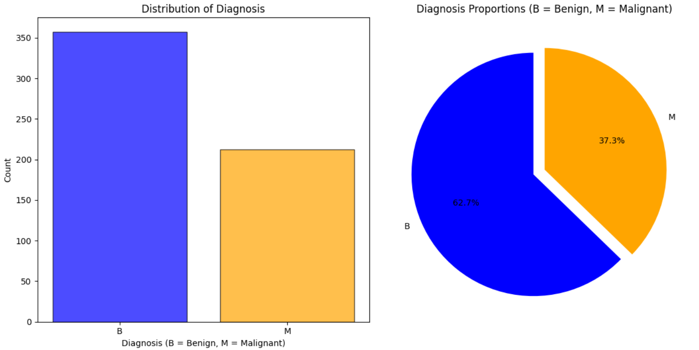

- **Boxplots grouped by 'diagnosis'**: Visualized feature distributions for benign and malignant cases.
  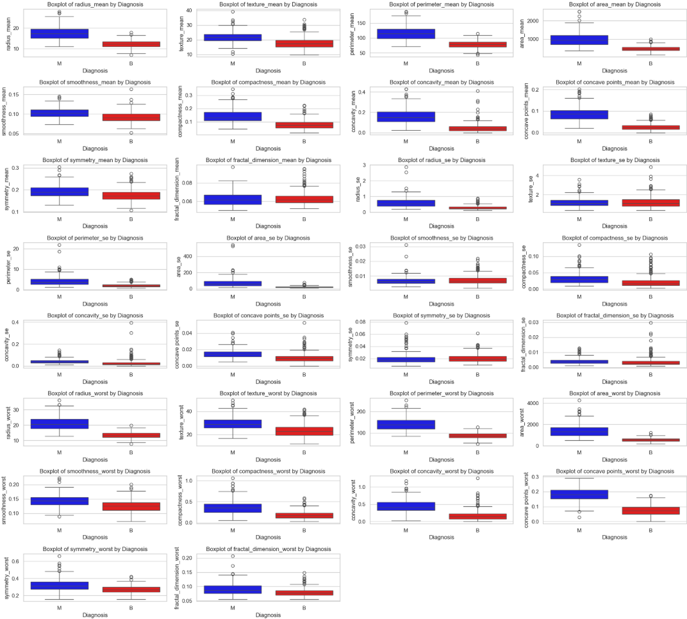

- **Correlation Analysis**: Visualized feature relationships with heatmaps and correlation to the target variable.
  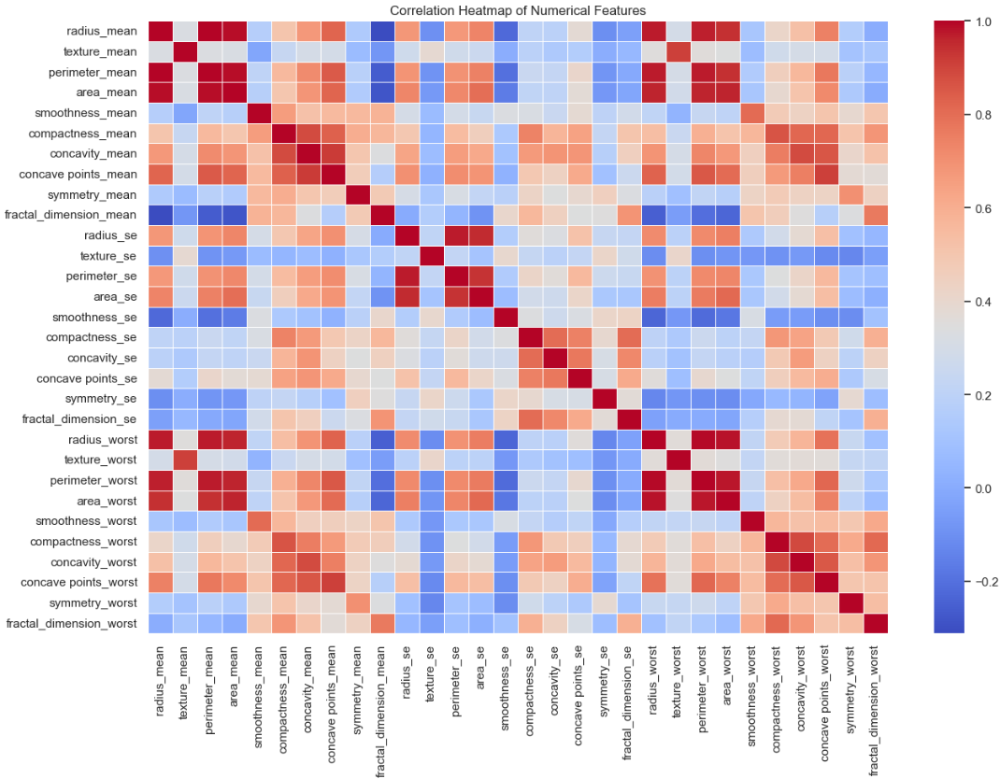
  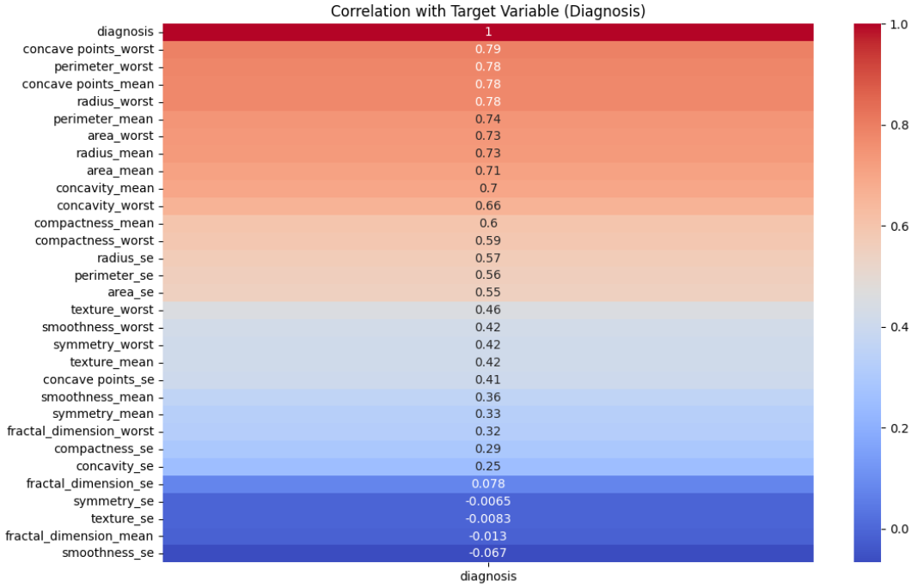

- **PCA Visualization**: Reduced dimensionality for visualization in 2D and 3D.
  - **PCA 2D**:

    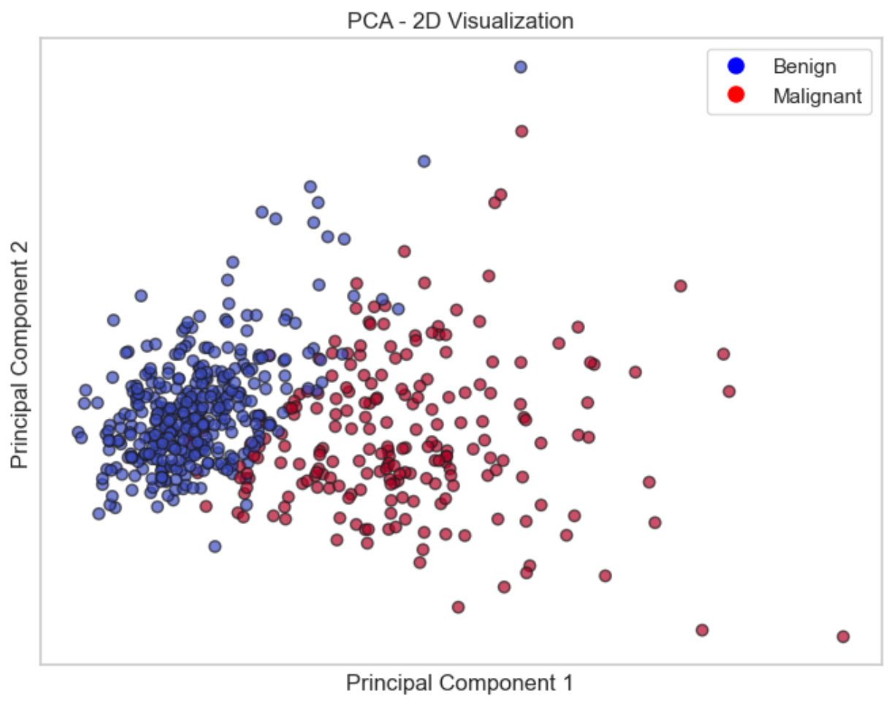

  - **PCA 3D**:

    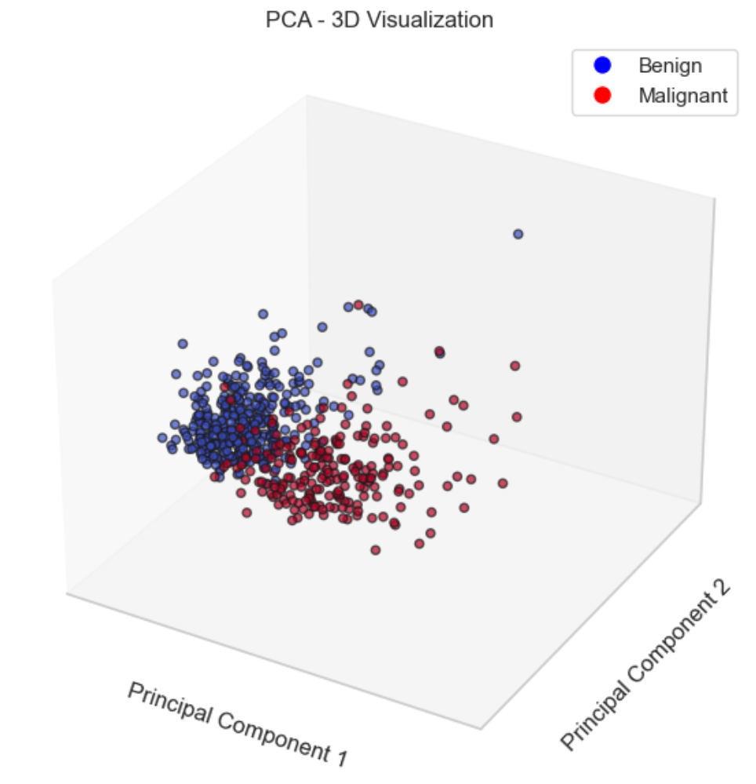

### **2. Feature Engineering**

- Applied preprocessing and feature selection techniques:
  - Scaled features using standardization.
  - Removed low-variance features.
  - Selected important features using:
    - Random Forest Feature Importance.
    - Mutual Information.
    - ANOVA F-Test.
    - Kruskal-Wallis H Test.

- **Feature Importance Analysis**: Highlighted the most impactful features.
  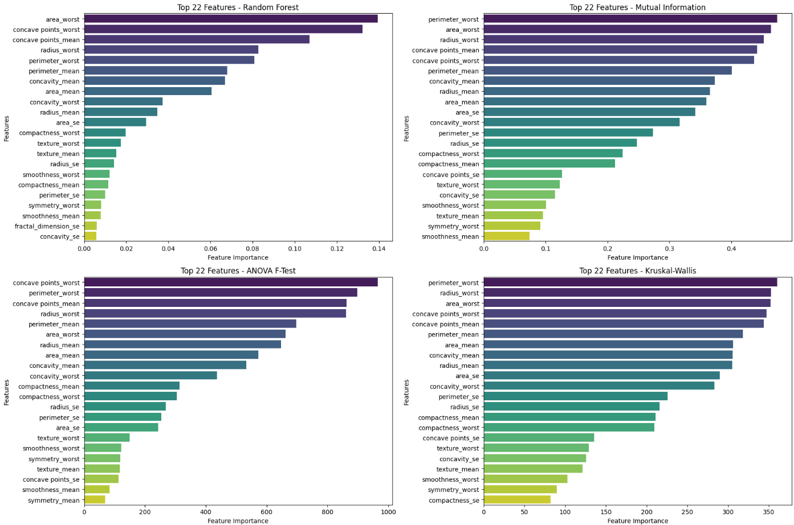

### **3. Model Development**

- Trained and evaluated multiple machine learning models:
  - Classification Models: Logistic Regression, Decision Tree, Random Forest, Gradient Boosting, XGBoost, LightGBM, CatBoost, SVM, k-NN, Naive Bayes, AdaBoost, Bagging, Extra Trees, Voting, Gaussian Process.
  - Neural Networks: Artificial Neural Network (ANN), and Multi-Layer Perceptron (MLP).
- Select models achieving F1-scores above 0.96 for further analysis.

- **Performance Comparison**: Compared metrics across models.
  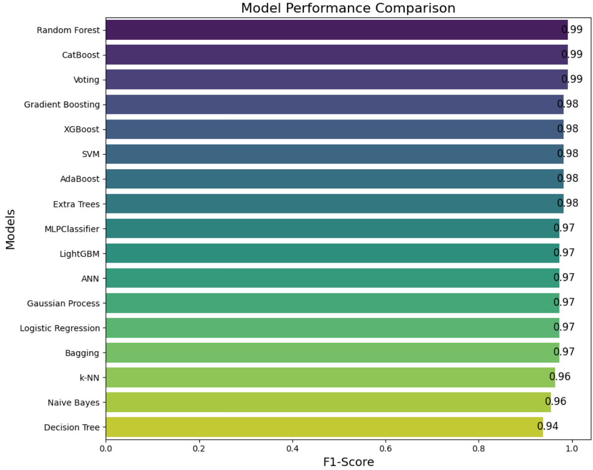

### **4. Interpretability Analysis**

- Used **SHAP** and **LIME** to perform interpretability analysis:
  - SHAP for Tree-Based Models and ANN.
  - LIME for general models.

### **5. Model Evaluation and Selection**

- The models for the next step were chosen based on a combination of interpretability and performance. This approach ensures that we have high-performing models along with simple interpretable models, which is critical for clinical applications where understanding the decision-making process is essential.
- Selected Models:
  - Logistic Regression
  - Gradient Boosting
  - LightGBM
  - XGBoost
  - CatBoost


### **6. Error Analysis**

Conducted a thorough error analysis, inspecting misclassified cases to identify the model's weaknesses.

- **Confusion Matrices**: Evaluated model predictions on the test set.

  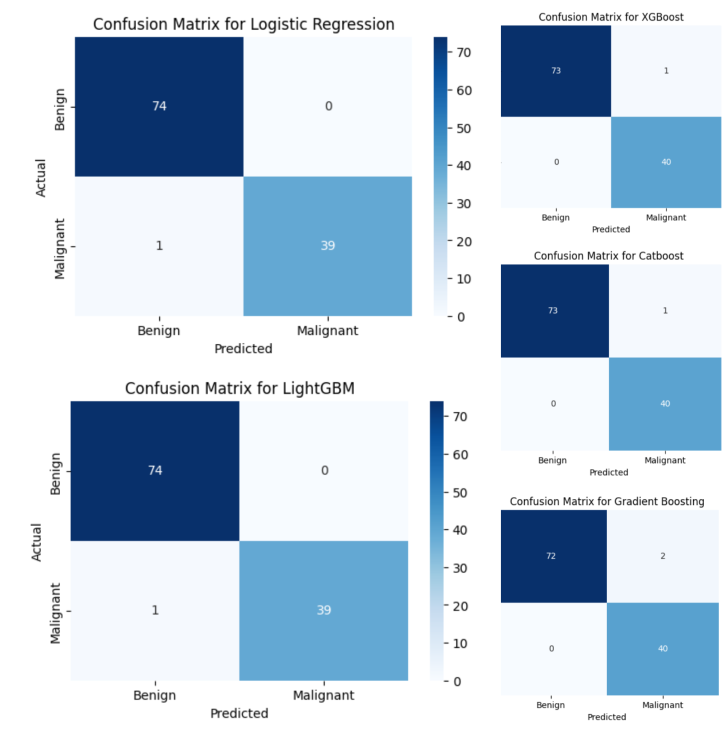


- **Performance Comparison**: Evaluated key metrics across selected models.

    | Metric          | Logistic Regression | Gradient Boosting | LightGBM | XGBoost | CatBoost |
    |-----------------|---------------------|-------------------|----------|---------|----------|
    | **Accuracy**    | 99.1%               | 98.2%             | 99.1%    | 99.1%   | 99.1%    |
    | **Precision**   | 100.0%              | 95.2%             | 100.0%   | 97.6%   | 97.6%    |
    | **Recall**      | 97.5%               | 100.0%            | 97.5%    | 100.0%  | 100.0%   |
    | **F1-Score**    | 98.7%               | 97.6%             | 98.7%    | 98.8%   | 98.8%    |
    | **ROC-AUC**     | 1.0                 | 1.0               | 1.0      | 1.0     | 1.0      |


The models evaluated (Logistic Regression, Gradient Boosting, LightGBM, XGBoost, and CatBoost) show high accuracy and excellent predictive performance on the test set.

#### **Observations**
1. **Overall Performance**:
   - All models perform well, with high F1-Scores, Accuracy, and ROC-AUC values.
   - Differences in performance are marginal, but minor trade-offs exist between precision and recall.

2. **Key Trade-Offs**:
   - **Logistic Regression and LightGBM**: Perfect precision but slightly lower recall, making them conservative predictors.
   - **Gradient Boosting, XGBoost, and CatBoost**: Perfect recall but slightly reduced precision, better for high-recall use cases like avoiding missed Malignant cases.

3. **Confusion Matrix Insights**:
   - Logistic Regression and LightGBM produce the fewest misclassifications, with only one false negative.
   - Gradient Boosting has more false positives but no false negatives, ideal for minimizing missed critical cases.

#### **For Deployment**:

- **Logistic Regression**:
  - Suitable if simplicity and interpretability are priorities.
  - Effective for clinical scenarios where precision (avoiding unnecessary treatments) is important.
  
- **Gradient Boosting**:
  - Prioritize for cases where recall (detecting all Malignant cases) is essential, even if it introduces more false positives.

- **LightGBM, XGBoost, and CatBoost**:
  - Excellent alternatives combining strong recall with slightly reduced precision.

--- 

## **Graphical User Interface (GUI)**

The **Streamlit-based GUI** provides an intuitive interface for users to use the breast cancer prediction app. The interface emphasizes simplicity, interpretability, and usability, ensuring users can make informed decisions with ease.

### **Key Features**:

1. **Interactive Input Fields**:
   - Users can enter patient data (tumor features) directly into the app and use buttons to increase/decrease values.

2. **Upload Document**:
   - Users can upload a CSV file containing for predictions.
   - The app processes the file and add new columns for prediction, predictions probabilities, and explanations.
   - The predictions are stored in the PostgreSQL database.

3. **Model Selection**:
   - Users can choose between multiple models (Logistic Regression, Gradient Boosting, XGBoost, Light GBM, Catboost) to see predictions and compare results.

4. **Prediction Visualization**:
   - Results are displayed classifying tumors as either **Benign** or **Malignant**.
   - Probabilities are provided alongside predictions to help assess certainty.

5. **Interpretability Tools**:
   - The GUI integrates explanations to display how each feature influenced the prediction, offering transparency in decision-making.

6. **Stored Predictions**:
   - All predictions are saved in a PostgreSQL database, allowing to track historical results and analyze patterns over time.

---

### **Data Drift Detection and Model Retraining**

The project includes a **data drift detection system** that monitors for significant changes in the input data distribution every month. A **Kolmogorov-Smirnov (KS) test** is used to compare the cumulative distributions of feature values in the current data against the original training dataset. The KS test measures the maximum difference between two cumulative distributions and determines whether they are statistically significantly different.

If the test detects significant differences (p-value < 0.05) in more than 20% of the features, the system flags the model for retraining to adapt to the new data distribution.

#### **Steps for Drift Detection and Mitigation**:
1. **Data Monitoring**: Each month, the system compares incoming data(Stored in the PostgreSQL Database Hosted on Neon) distributions against the training data(Baseline data) using the KS test.
2. **Drift Detection**: Data drift is detected if the KS test p-value is less than 0.05 for more than 20% of the features.
3. **Retraining**: When data drift is detected the systems starts retraining the models.
4. **Deployment**: The retrained models are automatically deployed to the Streamlit app.

This process is managed using **GitHub Actions**, which automates the monitoring and retraining process. Monthly, GitHub Actions triggers the data drift detection workflow, which runs the KS test and retrains the model if necessary.

#### **Practical Considerations**:
- Drift detection is unsupervised and does not require labels. However, retraining requires access to labeled data, making this system most effective in scenarios where new data can be labeled and incorporated into the training pipeline.

---

### **Deployment**

For the deployment, I have embedded many models in the Streamlit app. All the models' predictions can be explained. This approach allows us to have simple models like Logistic Regression for interpretability and complex models like Gradient Boosting, LightGBM, XGBoost, and CatBoost for high performance.
For both types, the application provides explanations for the predictions while giving users the opportunity to explore different models and compare the predictions.

---

## **Application Deployment**

### **Streamlit Cloud**

The app is live on **Streamlit Cloud** and can be accessed here:
[Breast Cancer Prediction App](https://touradb-breast-cancer-app.streamlit.app/)

### **Dockerized Version**

The app is fully Dockerized and can be pulled and run locally:

1. Pull the Docker image:
   ```bash
   docker pull touradbaba/model_engineering_app:latest
   ```  

2. Run the container:
   ```bash
   docker run -p 8501:8501 touradbaba/model_engineering_app:latest
   ```  

---

## **How to Run the Project Locally**

### **1. Clone the Repository**
```bash
git clone https://github.com/TouradBaba/model_engineering.git
cd model_engineering
```  

### **2. Set Up a Virtual Environment (Recommended)**
Setting up a virtual environment ensures that your project dependencies are isolated from your system Python installation, preventing conflicts with other projects.

#### **On Windows:**
1. Create a virtual environment:
   ```bash
   python -m venv myenv
   ```
2. Activate the virtual environment:
   ```bash
   myenv\Scripts\activate 
   ```

#### **On Linux/macOS:**
1. Create a virtual environment:
   ```bash
   python3 -m venv myenv
   ```
2. Activate the virtual environment:
   ```bash
   source myenv/bin/activate 
   ```

### **3. Install Dependencies**
Install all required packages using the `full_requirements.txt` file:
```bash
pip install -r full_requirements.txt
```  

### **4. Set up the PostgreSQL Database on Neon**
1. Create a PostgreSQL database on **Neon** and update the connection details in your local configuration.
2. Ensure the database is accessible for storing predictions.

### **5. Run the App Locally**
Start the Streamlit app:
```bash
streamlit run deployment/app.py
```

--- 

## **Screenshots of the Application**

### **Screenshot before prediction using Logistic Regression**
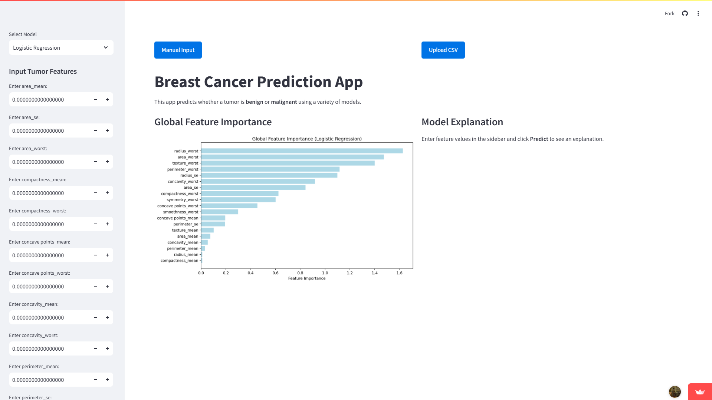

### **Screenshot after prediction using Logistic Regression**
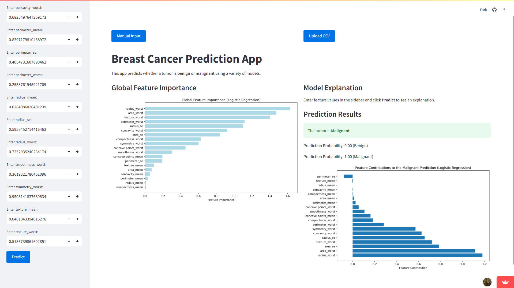

### **Screenshot before prediction using Logistic Regression-Upload document page**
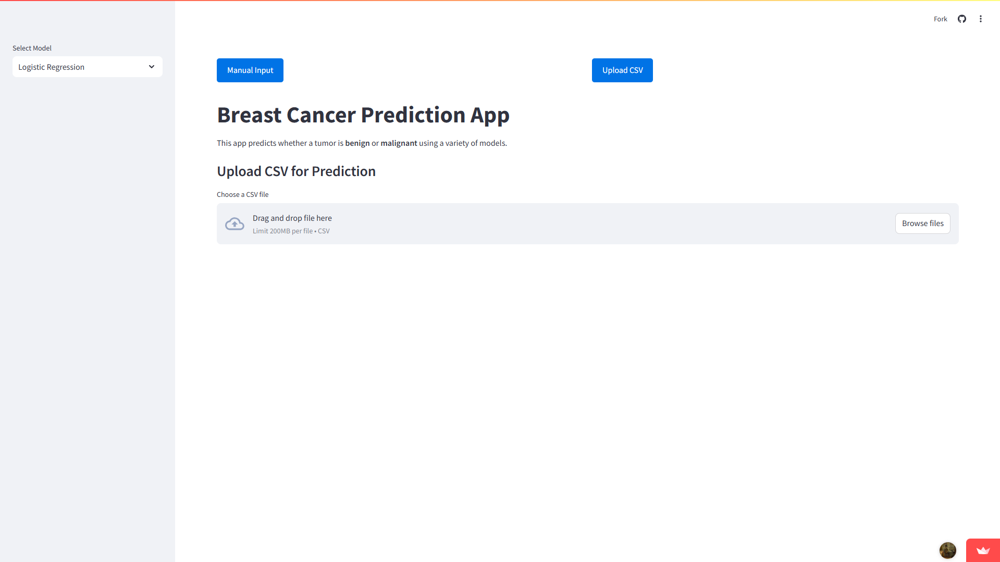

### **Screenshot after prediction using Logistic Regression-Upload document page**
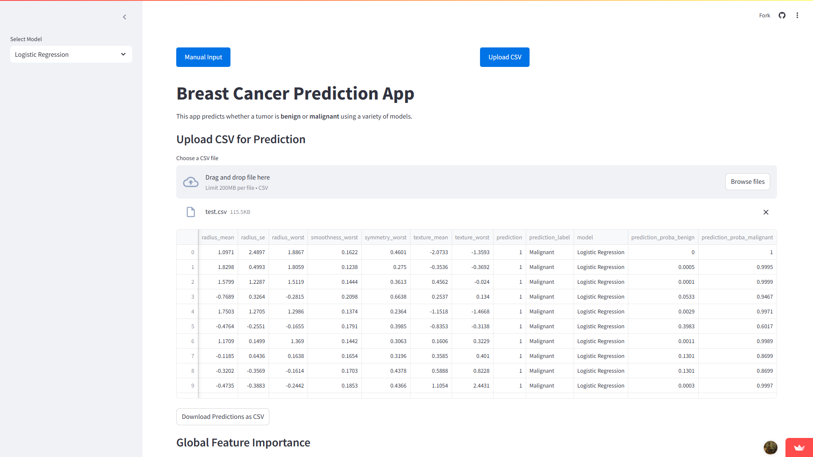
